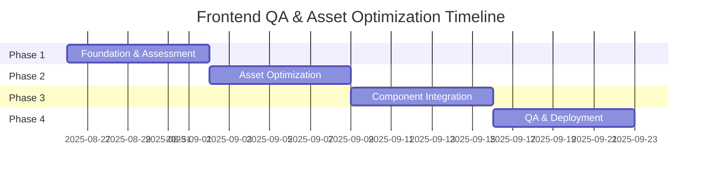

# 🚀 FRONTEND QA & ASSET OPTIMIZATION: 4-PHASE IMPLEMENTATION PLAN

## 📋 OVERVIEW

This document outlines a systematic 4-phase approach to implementing frontend QA testing and asset optimization for the EXJAM Alumni Platform, ensuring stable rollout and minimal disruption.

---

## 🎯 PHASE 1: FOUNDATION & ASSESSMENT (Week 1)

### **Objective**: Establish baseline and prepare infrastructure

### 📊 **Assessment Tasks**

- [ ] **Current State Analysis**
  - Audit existing assets and their sizes
  - Document current logo usage across components
  - Identify performance bottlenecks
  - Map all image references in codebase

- [ ] **Infrastructure Setup**
  - Configure Supabase storage buckets
  - Set up CDN access policies
  - Verify environment variables
  - Test upload/download capabilities

- [ ] **QA Framework**
  - Create automated testing scripts
  - Set up monitoring for page response times
  - Define success criteria and KPIs
  - Establish baseline performance metrics

### 🔧 **Technical Deliverables**

```bash
# Scripts to create
- test-page-status.js (basic health checks)
- asset-audit.js (inventory current assets)
- supabase-connection-test.js (verify storage access)
```

### ✅ **Success Criteria**

- [ ] All current assets catalogued
- [ ] Supabase storage configured and accessible
- [ ] Baseline performance metrics recorded
- [ ] Testing infrastructure ready

---

## 🖼️ PHASE 2: ASSET OPTIMIZATION & UPLOAD (Week 2)

### **Objective**: Optimize and migrate assets to Supabase

### 🎨 **Logo Optimization**

- [ ] **Logo Processing**
  - Compress SVG logos (remove unnecessary data)
  - Convert to multiple formats (PNG, WebP, AVIF)
  - Generate multiple sizes (32x32, 64x64, 128x128)
  - Test browser compatibility

- [ ] **Batch Upload to Supabase**
  - Upload optimized logos to `/logo/` path
  - Upload event images to `/events/` path
  - Verify all uploads with 200 status
  - Generate public URL inventory

### 🖼️ **Image Assets**

- [ ] **Event Image Processing**
  - Compress JPEG images (optimize quality vs size)
  - Generate responsive sizes (thumbnail, medium, full)
  - Add WebP alternatives for modern browsers
  - Create placeholder/loading images

### 🔧 **Technical Implementation**

```javascript
// Asset optimization pipeline
const optimizationPipeline = {
  svg: { minify: true, removeMetadata: true },
  png: { quality: 90, progressive: true },
  jpg: { quality: 85, progressive: true },
  webp: { quality: 80, lossless: false },
};
```

### ✅ **Success Criteria**

- [ ] All assets optimized (target: 70%+ size reduction)
- [ ] Assets uploaded to Supabase with proper organization
- [ ] Public URLs generated and tested
- [ ] Backup of original assets maintained

---

## ⚙️ PHASE 3: COMPONENT INTEGRATION (Week 3)

### **Objective**: Update components to use optimized Supabase assets

### 🔄 **Systematic Component Updates**

- [ ] **Header Components** (Priority 1)
  - Update `BasicHeader` component
  - Update `ImprovedHeader` component
  - Update standard `Header` component
  - Test responsive behavior

- [ ] **Footer Components** (Priority 2)
  - Update `SimpleFooter` component
  - Update standard `Footer` component
  - Verify layout consistency

- [ ] **Page Components** (Priority 3)
  - Update event detail pages
  - Update any inline image references
  - Implement Next.js Image components

### 🔧 **Configuration Updates**

- [ ] **Next.js Configuration**
  ```javascript
  // next.config.js updates
  images: {
    remotePatterns: [
      {
        protocol: 'https',
        hostname: 'your-supabase-url.supabase.co',
      },
    ],
  }
  ```

### 📱 **Testing Strategy**

- [ ] **Component-by-Component Testing**
  - Test each component individually
  - Verify images load correctly
  - Check responsive design
  - Test fallback behavior

### ✅ **Success Criteria**

- [ ] All 5+ components updated with Supabase URLs
- [ ] Images display correctly across all devices
- [ ] No broken image links
- [ ] Performance improved (faster loading)

---

## 🧪 PHASE 4: COMPREHENSIVE QA & DEPLOYMENT (Week 4)

### **Objective**: Validate entire system and prepare for production

### 🔍 **Comprehensive Testing**

- [ ] **Automated QA Suite**
  - Run full frontend page testing (all routes)
  - Test API endpoint responses
  - Verify all Supabase assets accessibility
  - Performance benchmarking

- [ ] **Cross-Browser Testing**
  - Chrome, Firefox, Safari, Edge
  - Mobile browsers (iOS Safari, Chrome Mobile)
  - Test image format fallbacks
  - Verify responsive breakpoints

- [ ] **Performance Validation**
  - Lighthouse audits
  - Core Web Vitals measurement
  - CDN response time testing
  - Image optimization verification

### 📊 **QA Reporting**

- [ ] **Generate Comprehensive Reports**
  ```markdown
  - QA_REPORT.md (detailed test results)
  - ASSETS_SUMMARY.md (asset inventory)
  - PERFORMANCE_REPORT.md (before/after metrics)
  - DEPLOYMENT_CHECKLIST.md (go-live requirements)
  ```

### 🚀 **Production Preparation**

- [ ] **Final Validations**
  - Staging environment testing
  - Production environment dry run
  - Rollback plan preparation
  - Monitor setup for post-deployment

### ✅ **Success Criteria**

- [ ] 95%+ QA test pass rate
- [ ] All performance targets met
- [ ] Documentation complete
- [ ] Production deployment approved

---

## 📈 IMPLEMENTATION TIMELINE



---

## 🛠️ PHASE-SPECIFIC SCRIPTS & TOOLS

### **Phase 1 Scripts**

```bash
# Assessment tools
./scripts/audit-current-assets.js
./scripts/test-supabase-connection.js
./scripts/baseline-performance.js
```

### **Phase 2 Scripts**

```bash
# Optimization tools
./scripts/optimize-images.js
./scripts/batch-upload-supabase.js
./scripts/generate-asset-urls.js
```

### **Phase 3 Scripts**

```bash
# Component update tools
./scripts/update-image-references.js
./scripts/test-component-rendering.js
./scripts/validate-responsive-design.js
```

### **Phase 4 Scripts**

```bash
# QA and deployment tools
./scripts/comprehensive-qa-test.js
./scripts/performance-benchmark.js
./scripts/generate-deployment-report.js
```

---

## ⚠️ RISK MITIGATION

### **Phase 1 Risks**

- **Risk**: Supabase configuration issues
- **Mitigation**: Test with dummy assets first
- **Rollback**: Use local assets as fallback

### **Phase 2 Risks**

- **Risk**: Asset optimization too aggressive (quality loss)
- **Mitigation**: A/B test optimization levels
- **Rollback**: Keep original assets as backup

### **Phase 3 Risks**

- **Risk**: Component updates break existing functionality
- **Mitigation**: Update one component at a time
- **Rollback**: Git branches for each component update

### **Phase 4 Risks**

- **Risk**: Production deployment issues
- **Mitigation**: Staged rollout with monitoring
- **Rollback**: Automated rollback scripts ready

---

## 📊 SUCCESS METRICS BY PHASE

### **Phase 1 Metrics**

- [ ] Infrastructure setup time < 2 days
- [ ] All assets catalogued (100% inventory)
- [ ] Baseline metrics captured

### **Phase 2 Metrics**

- [ ] Asset size reduction > 70%
- [ ] Upload success rate > 99%
- [ ] CDN response time < 100ms

### **Phase 3 Metrics**

- [ ] Component update success rate 100%
- [ ] No broken image links
- [ ] Responsive design maintained

### **Phase 4 Metrics**

- [ ] QA test pass rate > 95%
- [ ] Page load time improvement > 30%
- [ ] Zero production issues in first 24h

---

## 🎯 FINAL DELIVERABLES

By the end of Phase 4, you will have:

✅ **Optimized Asset Pipeline**

- All images optimized (70%+ size reduction)
- CDN delivery configured
- Multiple format support (PNG, WebP, AVIF)

✅ **Updated Components**

- 5+ header/footer components using Supabase assets
- Next.js Image components implemented
- Responsive design maintained

✅ **Comprehensive QA**

- Automated testing suite
- Performance benchmarks
- Cross-browser compatibility
- Production readiness validation

✅ **Documentation & Monitoring**

- Complete technical documentation
- Asset inventory and URLs
- Performance monitoring setup
- Rollback procedures

**🚀 Result: Production-ready frontend with optimized assets, improved performance, and professional logo integration!**
